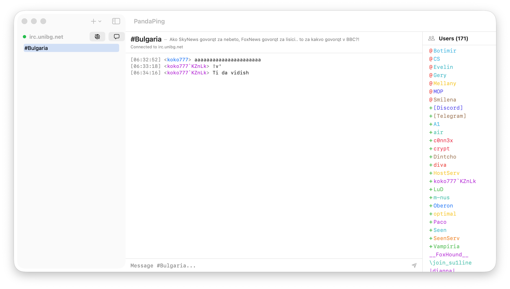
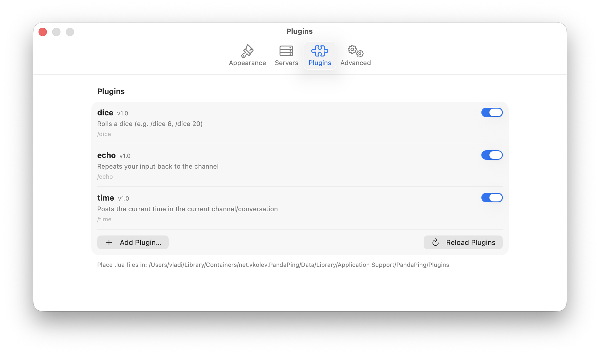
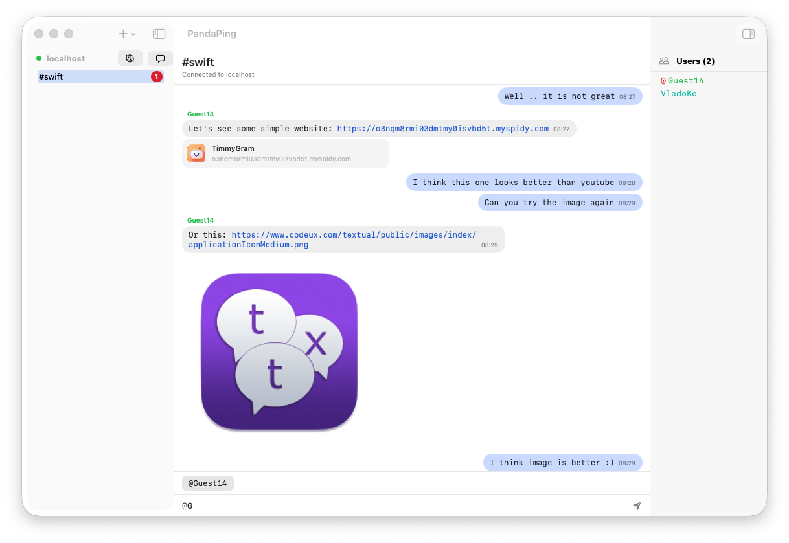
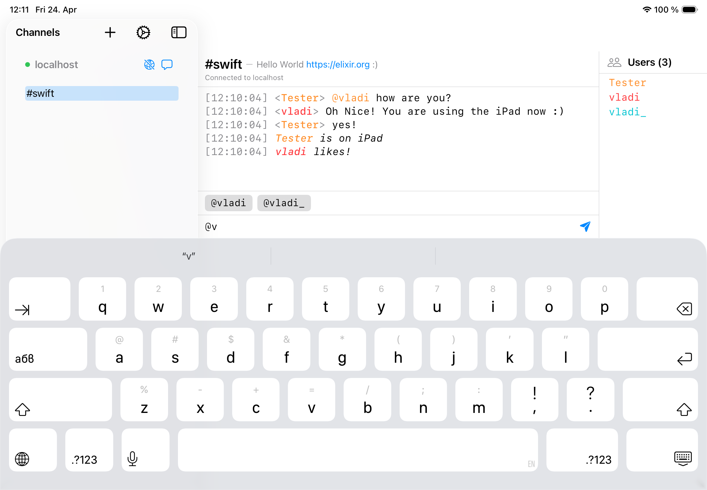

# PandaPing

A feature rich native macOS/iPadOS IRC Client with some Lua-Plugins support.

This project came to life from a personal need and I cannot hide it - with the progress in AI. For some time I was looking 
for a nice IRC Client for MacOS that gave me the old feeling of using mIRC some 20+ years ago. So I decided that the time has come 
to try and implement it as I want it. Of course AI was used to some extend.

## Features 

 - Native macOS/iPadOS experience using Swift/SwiftUI 
 - Plugin system - using LuaSwift integration with `[.safe]` library access
 - Multi-Server connections
 - Old-vibes look and feel (channel-server on the left, users list on the right)
 - Authentication support
 - SSL/TLS connection support
 - Light/Dark theme

## Screenshots

**MacOS**:

**iPadOS**

## Plugin Documentation

For plugin documentation please check [Docs/PluginAPI.md](Docs/PluginAPI.md).

## TODOs

 - [ ] Polishing interface
 - [ ] Polish authentication
 - [ ] Add themes for the chat and nickname list views 
 - [ ] More to come eventually
 - [x] Link previews
 - [x] Modern chat view (chat-bubbles)
 - [ ] Plugins for ContextMenu on User List ?

## NO TODOs / NO GOs 

 - [x] Plugin access to file system or network
 - [x] File send/receive
 - [x] Make it paid application

## License

MIT

## Contributions

Contributions are welcome, but please follow common sense and logic and be respectful.

